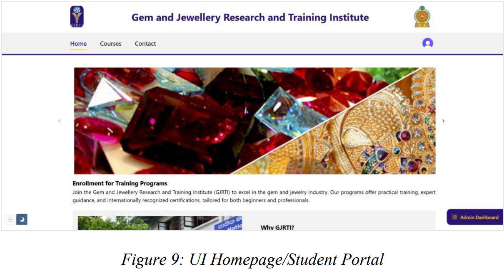
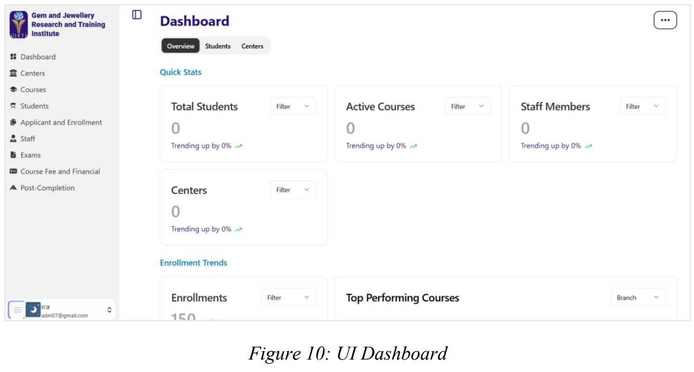
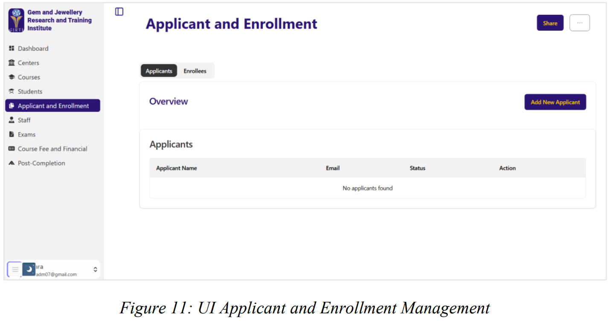
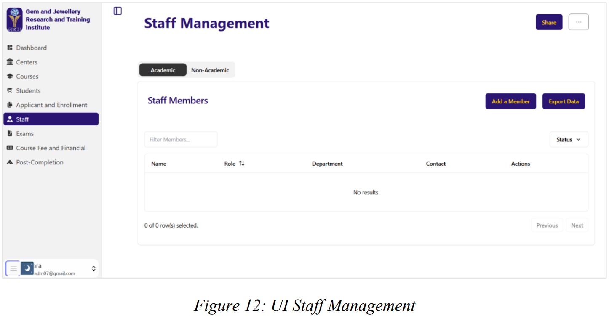
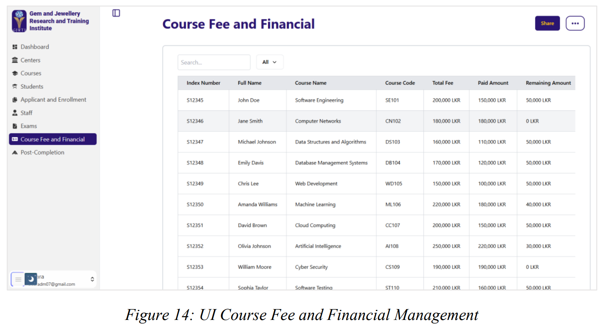

# GJRTI Management Information System (MIS)

A full-stack **web-based Management Information System** developed for the **Gem and Jewellery Research and Training Institute (GJRTI), Ministry of Industries – Sri Lanka**.
This system automates administrative and academic operations such as student enrollment, attendance tracking, examinations, financial management, and reporting.

---

## 📌 Overview

The Gem and Jewellery Research and Training Institute (GJRTI) previously relied on manual and paper-based administrative workflows. These processes caused delays, data inconsistencies, communication gaps, and increased workload for staff.

This project introduces a centralized digital platform that streamlines operations through automation and secure data management. The system provides real-time access to institutional information for administrators, instructors, and students.

The MIS:

* Automates administrative processes
* Centralizes institutional data
* Improves communication
* Enhances operational efficiency

> The system was developed as part of the BSc (Hons) Software Engineering degree at Sabaragamuwa University of Sri Lanka. 

---

## 🎯 Objectives

* Automate student enrollment and record management
* Provide centralized database management
* Track attendance and examinations
* Manage course fees and financial records
* Improve communication using notifications
* Generate reports for institutional decision-making
* Provide secure role-based access to users

---

## 🧩 Key Features

### 👨‍🎓 Student & Enrollment Management

* Online student registration
* Application approval/rejection
* Student profile management
* Batch transfers
* Academic progress tracking

### 🏫 Course & Center Management

* Manage multiple training centers
* Create and manage courses
* Assign instructors
* Schedule classes and timetables

### 📊 Attendance & Examination Management

* Attendance tracking
* Exam scheduling
* Marks management
* Result publishing
* Certificate issuance

### 💰 Financial Management

* Course fee management
* Payment tracking
* Financial summaries
* Invoice generation

### 👩‍💼 Staff Management

* Staff profiles
* Instructor assignment
* Employee records
* Visiting lecturers

### 📢 Communication & Reporting

* SMS and email notifications
* Automated alerts
* Performance reports
* Enrollment statistics
* Financial reports

### 🔐 Security

* Role-Based Access Control (RBAC)
* Secure authentication
* Encrypted data storage
* Activity logging

---

## 🛠️ Technology Stack

### Frontend

* HTML / CSS / JavaScript
* Responsive UI
* UI/UX designed in Figma
* ShadCN components

### Backend

* Node.js
* REST APIs

### Database

* MongoDB

### DevOps & Tools

* Docker (Containerization)
* Git & GitHub (Version control)
* Visual Studio Code

### Testing

* Mocha / Chai
* Selenium

---

## 🧱 System Architecture

The application follows a **web-based client–server architecture**:

```
Client (Browser / Mobile)
        ↓
Frontend (UI)
        ↓
REST API Server (Node.js)
        ↓
Database (MongoDB)
```

---

## 👥 User Roles

| Role       | Permissions                            |
| ---------- | -------------------------------------- |
| Admin      | Full system control, reports, finance  |
| Instructor | Attendance, exams, student records     |
| Student    | View courses, exams, payments, results |

---

## 📂 Main Modules

* Center Management
* Course Management
* Applicant & Enrollment Management
* Student Management
* Staff Management
* Attendance Tracking
* Exams Management
* Financial Management
* Certificate Management
* Reporting System

---

## 📸 Screenshots

### 🏠 Home Page / Student Portal



The landing page provides general information about the institute and allows students to access courses, announcements, and login to the system.

---

### 📊 Admin Dashboard



The dashboard displays system statistics such as:

* total students
* active courses
* staff members
* enrollment trends

Administrators can quickly monitor institutional activities from this panel.

---

### 📝 Applicant & Enrollment Management



Admins can:

* view applicants
* approve/reject applications
* manage enrollment records
* track application status

---

### 👩‍🏫 Staff Management



This module allows administrators to:

* add instructors and staff
* edit employee details
* assign roles and responsibilities

---

### 🧪 Exams Management


The exam module supports:

* exam scheduling
* student exam registration
* marks entry
* results publication

---

### 💰 Course Fee & Financial Management



Financial operations include:

* fee tracking
* payment status
* outstanding balances
* financial reports

---

### 📅 Attendance Tracking


Instructors can digitally record attendance and the system automatically stores and analyzes participation records.

---

### 🎓 Certificate & Results


Students can view results and download course completion certificates after successfully finishing the course.


## 💻 System Requirements

### Developer

* Node.js
* MongoDB
* Git
* Docker (optional)

### End Users

* Modern Web Browser (Chrome, Edge, Firefox)
* Internet connection
* Desktop or Mobile device

---

## 🚀 Future Improvements

* Online payment gateway integration
* Biometric attendance
* SMS gateway automation
* Mobile application
* Analytics dashboard
* AI-based performance insights

---

## 📈 Expected Benefits

* Reduced paperwork
* Faster administrative workflows
* Accurate record keeping
* Improved communication
* Better decision-making

---

## 👨‍💻 Development Team

**Group 07 – Faculty of Computing**
Department of Software Engineering
Sabaragamuwa University of Sri Lanka

* D. D. Mapalagama
* R. L. T. N. Rathnayaka
* L. D. A. Thilakarathne
* M. S. Hewage
* V. Janarthan

---

## 📄 License

This project is developed for academic and community purposes but with Confidentiality agreement with GJRTI.
You may use, modify, and extend it for educational or institutional use with proper attribution.

---

## 🙏 Acknowledgment

We gratefully acknowledge the support of the Gem & Jewellery Research and Training Institute (GJRTI) and the Faculty of Computing, Sabaragamuwa University of Sri Lanka, for providing guidance and resources for this project.

---

## 📬 Contact

For inquiries, issues, or contributions, please open an issue on the GitHub repository.

---

⭐ If you found this project helpful, consider giving it a star!
